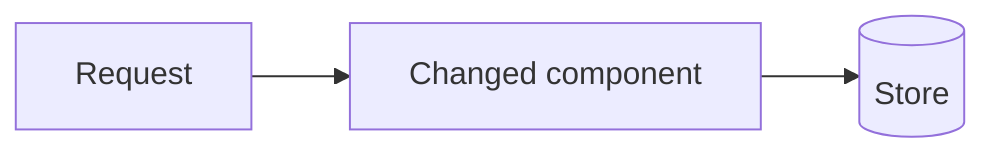

# PR Writing Reference

Read when composing a PR title, body, template-based publication, or
incremental update comment.

Write for a human reviewer deciding how much attention this PR deserves. Some
reviews matter more than others: lead with what changed and why, show the
shape of the change when a picture helps, and end with an honest account of
what could go wrong after merge and how hard it would be to undo.

## Title

Write a short outcome-focused title. Prefer verbs and user-visible effects over
implementation mechanics. Avoid vague titles such as `updates`, `misc fixes`,
or `work on feature`.

## Body

Use the repository template when available (see Templates and plans). When no
useful template exists:

````markdown
## Summary
One to three plain-language sentences: what changes, why, and who notices.

**Review weight:** Low | Medium | High - one-line reason

## How it works


## Changes
- ...
- ...

## Testing
- `command` - passed

## Notes
- ...

## Merge danger
- **Door:** Two-way | One-way - why
- **Revert:** what undoing this takes
- **Blast radius:** who or what is affected if this is wrong
- **Watch after merge:** the signal that would show a problem
````

Section rules:

- **Summary** is for a reviewer who reads nothing else. Avoid file names and
  jargon there; save mechanics for `Changes`.
- **Review weight** tells the reviewer how carefully to look. Derive it from
  the merge danger assessment: a one-way door or a wide blast radius is at
  least Medium; a one-way door with a wide blast radius is High.
- **How it works** is optional. Include it only when the rules in Mermaid
  diagrams apply; otherwise omit the heading entirely.
- **Changes** groups the diff by behavior or area, not by commit. Call out the
  files that most deserve review attention.
- **Testing** appears only when tests were run or a passing result was directly
  observed.
- **Notes** holds follow-ups, migrations, screenshots that still need human
  review, or plan/diff mismatches. Omit it when empty.
- **Merge danger** is always the last section, even when every line is
  low risk. Short is fine; missing is not.

Never claim approvals, screenshots, deployments, passing CI, or test results
that were not observed.

## Mermaid diagrams

GitHub renders fenced `mermaid` blocks in PR bodies. Use a diagram when it
shows something faster than prose:

- `flowchart` for how components, modules, or services connect after the
  change, or a before/after of a restructured path.
- `sequenceDiagram` for request, auth, webhook, event, or other time-ordered
  flows that the change touches.
- `stateDiagram-v2` for changed status or lifecycle transitions.

Omit the diagram for single-file fixes, copy changes, dependency bumps, and
anything a diagram would only restate. Keep diagrams to about 12 nodes, draw
only what the diff shows, and highlight the changed part, for example with a
`classDef changed` style or a `(new)` / `(changed)` label. Quote labels that
contain punctuation (`A["parse(input)"]`) so the diagram renders.

## Incremental updates

For an already open PR, an update comment should describe only the incremental
change since the last pushed commit visible on the PR:

```markdown
## Update summary
- ...
- ...

## Testing
- `command` - passed

## Merge danger
- Unchanged.
```

Write `Unchanged.` under Merge danger when the update does not move the
assessment. Otherwise restate only the lines that changed, and update the PR
body so its Merge danger section stays current.

## Templates and plans

Preserve applicable template headings and leave checklist items unchecked unless
directly verified. Remove placeholder instructions when replacing them with
real content; do not invent issue links, screenshots, reviewers, approvals, or
deployment notes. Unless the template already has an equivalent, add the
Review weight line near the top, a diagram when the Mermaid diagram rules
apply, and `## Merge danger` as the last section. If `plan.md` exists, use it
as intent context, not proof; the observed diff and command output win when
they conflict.
