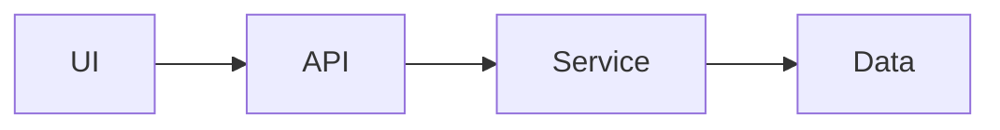
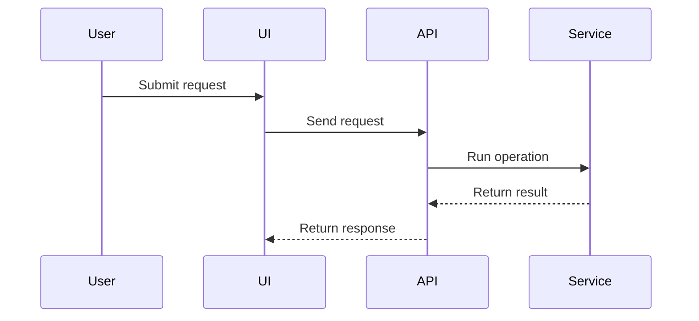

# Plan Template

Use this template as the default structure for `plan.md`.

````markdown
# Plan: {{title}}

## Human Summary

{{Explain the goal, intended implementation shape, why the order matters, and what the human reviewer should watch for.}}

## Visual Overview

{{Include the architecture sketch, sequence diagram, both, or neither. Omit visuals when they would be trivial or misleading.}}

### Architecture Sketch



### Sequence Diagram



## Phase Implementation Plan

### Phase 1: {{phase name}}

**Goal:**
{{Why this phase exists and what it should accomplish.}}

**Tasks:**
- [ ] `phase-task-id` {{concrete action}}
  - {{Optional task-specific implementation latitude.}}
- [ ] `phase-task-id` {{concrete action}}

**Done when:**
- {{Observable phase-level result.}}

**Pause if:**
- {{Specific condition requiring review.}}

**Implementation notes:**
{{Optional constraints or context worth accounting for. Omit this aside when it adds no value.}}

## File Impact Matrix

| File / Area | Action | Purpose | Risk |
|---|---|---|---|
| `path/or/area` | Inspect/Create/Modify/Delete/Unknown | {{purpose}} | Low/Medium/High |

## Test / Verification Plan

### Manual Checks

- [ ] `manual-check-id` {{manual check}}

### Automated Checks

- [ ] `automated-check-id` {{test or command, if known}}

## Acceptance Criteria

- [ ] {{observable done condition}}

## Unknowns to Resolve

- [ ] `unknown-id` {{unknown to resolve}}

## Stop Conditions

Stop and ask for review if:

- {{stop condition}}

## Additional Context

{{Optional relevant references, history, constraints, or alternatives. Omit when there is no useful supporting context.}}

````
