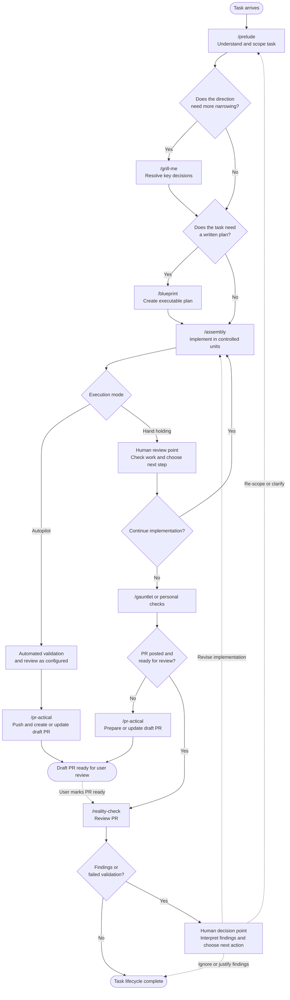

# Skills Lifecycle

The workflow is intentionally flexible. `/grill-me` and `/blueprint` are optional, while `/assembly` is the implementation handoff. Review and validation can happen before or after `/pr-actical`, depending on whether the work is being done step by step or autonomously.

