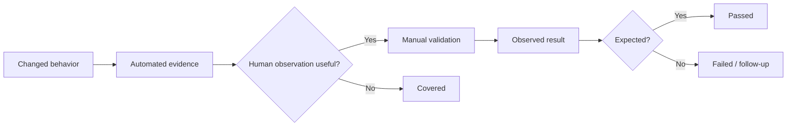
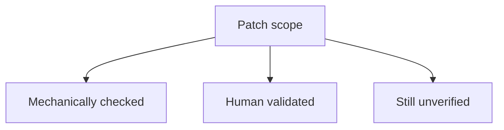

# `review.md` Template

Use this as the default structure. Adapt section depth to the patch. Keep the file concise enough to scan while preserving the evidence needed to resume later.

```markdown
# Patch Review

> **Status:** In progress | Complete | Blocked
> **Review depth:** Light | Standard | Elevated

## Review Target

| Field | Value |
| --- | --- |
| PR | `#...` or N/A |
| Branch | `...` |
| Base | `...` |
| HEAD | `...` |
| Started | `...` |

## Change Summary

Briefly describe what behavior changed and which files/components are in scope.

## Review-Depth Decision

**Decision:** Standard

**Rationale:** Explain why this depth is proportionate to the actual patch.

## Automated Checks

| Check | Command | Result | Notes |
| --- | --- | --- | --- |
| Formatting | `...` | Passed | Check-only mode |
| Lint | `...` | Passed | ... |
| Focused tests | `...` | Passed | ... |

### Mechanical Issues

Record failures or blocked checks. Use `None` when there are none.

## Validation Map

| Changed behavior | Automated evidence | Human validation needed | Status |
| --- | --- | --- | --- |
| ... | ... | ... | Pending |



## Manual Validation

### 1. Descriptive scenario name

**Why this matters**

Tie the test directly to the patch or a credible regression surface.

**Steps**

1. ...
2. ...
3. ...

**Expected**

Describe what the human should observe and understand.

**Observed**

Record the user's actual result. Do not replace this with the expected result.

**Evidence**

Record relevant pasted output, screenshot description/reference, environment/device detail, or `User observation only` when stronger evidence was unnecessary.

**Status:** Pending | Passed | Failed | Blocked

**Follow-up**

Add only when needed.

## Coverage Snapshot



Keep or replace this diagram only when it helps summarize the actual review. Prefer a patch-specific diagram over a generic one.

## Unresolved Areas

- List anything not validated, why, and the consequence for confidence.
- Use `None` only when the review genuinely covers all meaningful areas.

## Final Assessment

State what is established, what remains uncertain, and whether the available evidence supports the patch's intended behavior. Keep automated and human evidence distinguishable.
```

## Formatting guidance

- Prefer short sections and tables for status-heavy information.
- Use Mermaid only for meaningful flow, dependencies, coverage, or state transitions.
- Keep evidence close to the test it supports.
- Preserve failed and blocked results rather than rewriting history.
- Update existing sections incrementally instead of regenerating the file from scratch after every user response.
