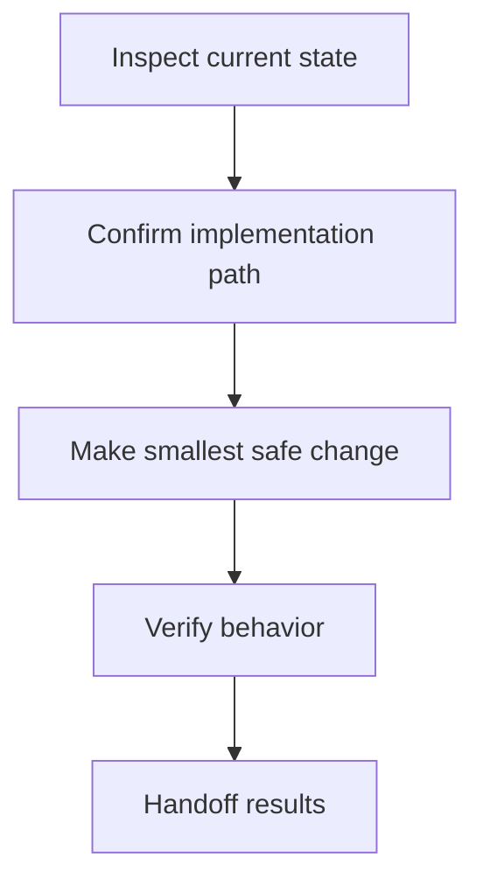
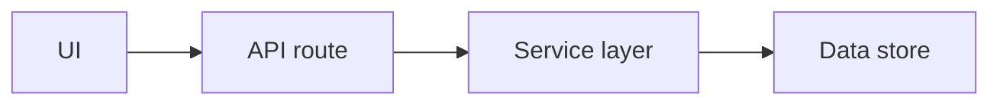
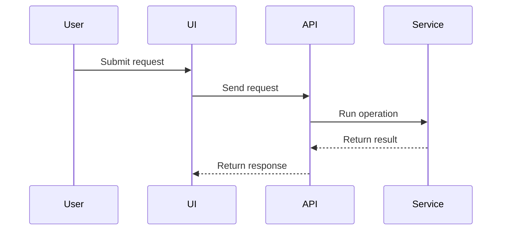

# Visual Coding Plan

## Purpose

Create a single `plan.md` that is readable in plain Markdown, helpful in GitHub or VS Code previews, and executable by a coding agent. Favor structured Markdown as the source of truth. Use Mermaid and restricted HTML only as safe visual enhancements.

## Output Contract

Always produce one Markdown file named or formatted as `plan.md` unless the user explicitly asks otherwise.

The plan must prioritize, in this order:
1. Human summary and narrative reviewability.
2. Decision log.
3. Agent task list with stable IDs.
4. File impact matrix.
5. Risk matrix.
6. Test/verification plan.
7. Acceptance criteria.
8. Restricted HTML blocks.
9. Execution map.
10. Architecture sketch.
11. Sequence diagram.
12. Phase timeline.

Do not create MDX. Do not use custom JSX components. Do not rely on a custom renderer. The plan must remain useful if Mermaid does not render and if HTML collapsibles are displayed as plain markup.

## Workflow

1. Determine the planning target from the user request, issue, repo context, or provided notes.
2. If repo context is available, inspect enough to avoid inventing file paths, frameworks, or commands. If repo context is not available, mark uncertain details in `Unknowns to Resolve First` instead of guessing.
3. Draft `plan.md` using the required section order below.
4. Add visual enhancements only when they clarify execution:
   - Use Markdown tables for snapshots, decisions, files, and risks.
   - Use Mermaid `flowchart TD` for one simple execution map when useful.
   - Use Mermaid architecture or sequence diagrams only for multi-part systems or request/response flows.
   - Use restricted HTML only for `<details>` and `<summary>` collapsible context.
5. Review the plan against the self-check checklist before finalizing.

## Required Section Order

Use this section order by default. Omit optional diagram sections only when they do not help or would be misleading.

```markdown
# Plan: {{title}}

## Human Summary

## Decision Log

## Agent Task List

## File Impact Matrix

## Risk Matrix

## Test / Verification Plan

## Acceptance Criteria

## Assumptions and Unknowns

## Stop Conditions

## Agent Handoff Prompt

## Additional Context

## Execution Map

## Architecture Sketch

## Sequence Diagram

## Phase Timeline
```

### Human Summary

Write a plain-language narrative for Pat as a junior-ish developer reviewing the plan before handing it to a code agent. Explain what will happen, why the order matters, and what to watch for. Keep it concise but engaging.

### Decision Log

Use a Markdown table. Include meaningful choices only; do not invent fake decisions.

```markdown
| Decision | Choice | Why | Confidence |
|---|---|---|---|
| {{decision}} | {{chosen approach}} | {{reason}} | High/Medium/Low |
```

If no meaningful decisions are known yet, include a short note: `No major implementation decisions are locked yet; resolve the unknowns first.`

### Agent Task List

Every actionable task must have a stable, unique, kebab-case ID in backticks. Tasks should be ordered for execution.

```markdown
- [ ] `inspect-routing` Identify the current routing structure before editing.
- [ ] `inspect-auth-patterns` Check for existing auth/session utilities.
- [ ] `implement-login-ui` Create or update the login UI.
```

Good task IDs are short, durable, and action-oriented. Avoid vague tasks like `fix-stuff` or `update-code`.

### File Impact Matrix

Use a Markdown table. If files are known, list paths. If files are uncertain, list areas or inspection targets and say they are unconfirmed.

```markdown
| File / Area | Action | Purpose | Risk |
|---|---|---|---|
| `src/example.ts` | Modify | {{purpose}} | Medium |
| Routing layer | Inspect | Confirm where protected routes are defined | Medium |
```

Actions should usually be `Inspect`, `Create`, `Modify`, `Delete`, `Move`, or `Unknown`.

### Risk Matrix

Use a Markdown table with practical mitigations.

```markdown
| Risk | Level | Why it matters | Mitigation |
|---|---|---|---|
| {{risk}} | High/Medium/Low | {{impact}} | {{specific mitigation}} |
```

### Test / Verification Plan

Keep verification proportional. Do not require new test infrastructure unless the task warrants it or the repo already has tests.

Separate checks when helpful:

```markdown
### Manual Checks

- [ ] `verify-ui-loads` Visit the affected page and confirm it loads.

### Automated Checks

- [ ] `verify-existing-tests` Run the existing relevant test command if present.
```

### Acceptance Criteria

Use observable done conditions, not vague claims.

Good:
```markdown
- [ ] Unauthenticated users are redirected to `/login` when visiting protected routes.
```

Avoid:
```markdown
- [ ] Auth works.
```

### Assumptions and Unknowns

Separate assumptions from unknowns. Unknowns that must be resolved before implementation should become tasks or stop conditions.

```markdown
### Assumptions

- {{assumption}}

### Unknowns to Resolve First

- [ ] `unknown-existing-auth` Check whether an auth provider already exists.
```

### Stop Conditions

Include conditions where the executing agent should pause rather than improvise.

```markdown
Stop and ask for review if:

- Existing infrastructure conflicts with this plan.
- The work requires a schema migration not covered here.
- The expected files or framework are not present.
```

### Agent Handoff Prompt

End with a short prompt another coding agent can follow.

```markdown
Execute this plan phase by phase. Start by resolving unknowns, then complete tasks in order. Do not skip the acceptance criteria or verification plan. If a stop condition is hit, pause and report the finding before continuing.
```

## Visual Enhancement Rules

### Restricted HTML

Allowed HTML:
- `<details>`
- `<summary>`

Use it only for collapsible supporting information such as alternatives considered, extra notes, or lower-priority context.

```markdown
<details>
<summary>Alternatives considered</summary>

- Option A: {{description}}
- Option B: {{description}}

</details>
```

Banned HTML:
- inline styles
- scripts
- iframes
- custom classes
- arbitrary layout divs
- custom web components

### Mermaid Execution Map

Use at most one default execution map. Prefer `flowchart TD`. Keep labels short. Maximum 10 nodes unless the user asks for more detail.

```markdown

```

Avoid long file paths, backticks, quotes, braces, parentheses, and punctuation-heavy labels inside Mermaid nodes. Put detailed file paths in tables, not diagrams.

### Architecture Sketch

Include only when the task involves at least three interacting parts. Label uncertain architecture as proposed.

```markdown

```

### Sequence Diagram

Include only for request/response, webhook, auth, event, or multi-system flows. Keep participants to 5 or fewer.

```markdown

```

### Phase Timeline

Use Markdown as the source of truth. Add a very small Mermaid phase summary only if it clarifies the plan. Do not use Gantt charts by default.

## Simplicity and Fallback Rules

- If a visual element risks becoming brittle, use a Markdown table or list instead.
- If Mermaid syntax becomes complex, simplify or remove the diagram.
- If repo facts are unknown, say so and make inspection the first task.
- Never let visuals replace the actionable Markdown plan.
- Keep the plan readable if all diagrams fail to render.

## Self-Check Before Finalizing

Before finalizing, verify:

- The plan is a single `plan.md`-style Markdown output.
- No MDX, JSX, imports, or custom components are present.
- Every actionable task has a unique stable ID.
- The Human Summary explains the work and order clearly.
- The Decision Log includes real decisions or explicitly says none are locked.
- The File Impact Matrix distinguishes confirmed files from uncertain areas.
- The Risk Matrix includes specific mitigations.
- The Verification Plan is proportional to the work.
- Acceptance Criteria are observable.
- Stop Conditions are included.
- HTML, if present, is limited to `<details>` and `<summary>`.
- Mermaid diagrams, if present, have short labels and simple syntax.
- The plan remains useful as plain Markdown.

## References

Load these references only when useful:

- `references/plan-template.md` for the complete reusable plan skeleton.
- `references/visual-components.md` for component-by-component guidance and examples.
- `references/anti-patterns.md` for common failure modes to avoid.
