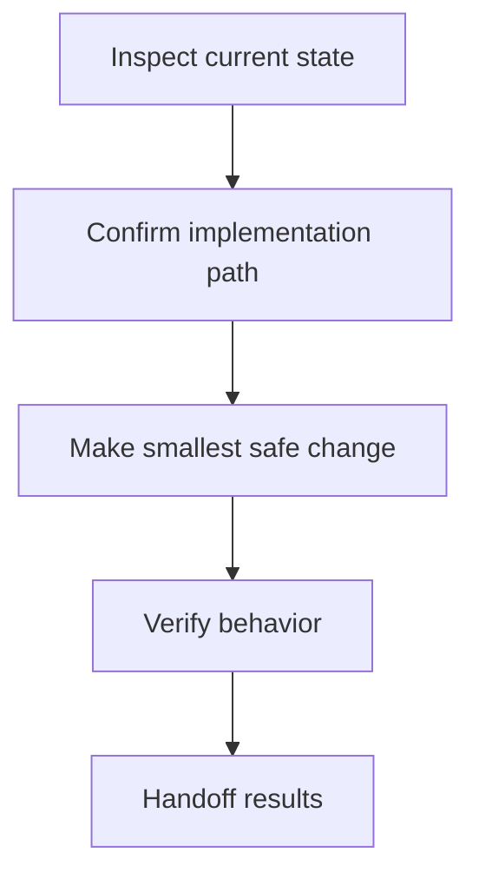
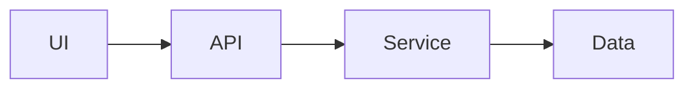
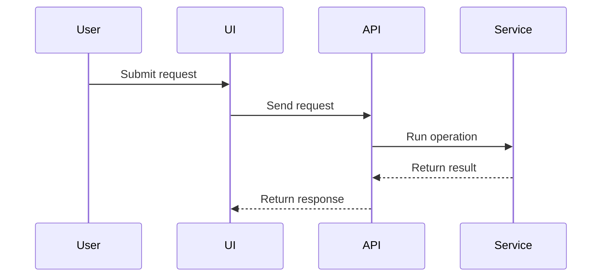

# Plan Template

Use this template as the default structure for `plan.md`.

```markdown
# Plan: {{title}}

## Human Summary

{{Explain the goal, intended implementation shape, why the order matters, and what the human reviewer should watch for.}}

## Decision Log

| Decision | Choice | Why | Confidence |
|---|---|---|---|
| {{decision}} | {{choice}} | {{reason}} | High/Medium/Low |

## Agent Task List

- [ ] `task-id` {{actionable task}}
- [ ] `task-id` {{actionable task}}

## File Impact Matrix

| File / Area | Action | Purpose | Risk |
|---|---|---|---|
| `path/or/area` | Inspect/Create/Modify/Delete/Unknown | {{purpose}} | Low/Medium/High |

## Risk Matrix

| Risk | Level | Why it matters | Mitigation |
|---|---|---|---|
| {{risk}} | Low/Medium/High | {{impact}} | {{mitigation}} |

## Test / Verification Plan

### Manual Checks

- [ ] `manual-check-id` {{manual check}}

### Automated Checks

- [ ] `automated-check-id` {{test or command, if known}}

## Acceptance Criteria

- [ ] {{observable done condition}}

## Assumptions and Unknowns

### Assumptions

- {{assumption}}

### Unknowns to Resolve First

- [ ] `unknown-id` {{unknown to resolve}}

## Stop Conditions

Stop and ask for review if:

- {{stop condition}}

## Agent Handoff Prompt

Execute this plan phase by phase. Start by resolving unknowns, then complete tasks in order. Do not skip the acceptance criteria or verification plan. If a stop condition is hit, pause and report the finding before continuing.

<details>
<summary>Additional context</summary>

{{Optional supporting detail that should not clutter the main plan.}}

</details>

## Execution Map



## Architecture Sketch



## Sequence Diagram



## Phase Timeline

### Phase 1: {{phase name}}

Goal: {{phase goal}}

- [ ] `phase-task-id` {{task}}
```
