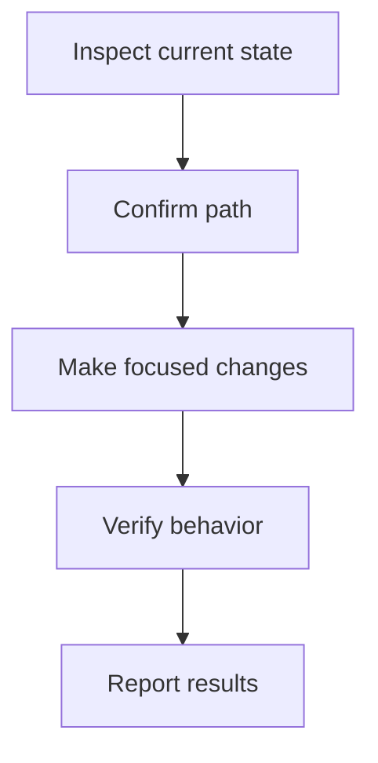

# Visual Components Reference

Use this file when a `plan.md` needs richer section guidance than the core skill provides. Keep the final plan in plain Markdown. Do not copy every example blindly; adapt the smallest useful pattern.

## Contents

- Human Summary
- Visual Overview
- Decision Log
- Risk Matrix
- Agent Task List
- Phase Implementation Plan
- File Impact Matrix
- Test / Verification Plan
- Acceptance Criteria
- Assumptions and Unknowns
- Stop Conditions
- Restricted HTML Blocks

## Human Summary

Purpose: orient the reviewer before tables and tasks. Explain the goal, the intended implementation shape, why the order matters, and what to watch for.

Format: short paragraphs, optionally followed by a compact snapshot table.

## Visual Overview

Purpose: make diagrams part of the review path instead of appendix material.

Use an execution map for sequencing:



Use architecture sketches only when at least three parts interact, such as UI, API, service, worker, data store, or external system. Use sequence diagrams only for request/response, webhook, auth, event, or other time-ordered flows. Keep diagrams compact and let Markdown tasks remain the source of truth.

## Decision Log

Purpose: expose the choices behind the plan.

```markdown
| Decision | Choice | Why | Confidence |
|---|---|---|---|
| {{decision}} | {{chosen approach}} | {{reason}} | High/Medium/Low |
```

If no meaningful decisions are known yet, write: `No major implementation decisions are locked yet; resolve the unknowns first.`

## Risk Matrix

Purpose: let risk shape execution order, stop conditions, and verification.

```markdown
| Risk | Level | Why it matters | Mitigation |
|---|---|---|---|
| {{risk}} | High/Medium/Low | {{impact}} | {{specific mitigation}} |
```

## Agent Task List

Purpose: make the plan executable, trackable, resumable, and easy to reference.

Every task starts with a unique kebab-case ID in backticks:

```markdown
- [ ] `inspect-routing` Identify the current routing structure before editing.
- [ ] `confirm-auth-patterns` Check for existing auth/session utilities.
- [ ] `implement-login-ui` Create or update the login UI.
```

Keep tasks ordered enough to guide execution, but do not turn them into a commit-by-commit script unless the user explicitly asks for strict commit planning.

## Phase Implementation Plan

Purpose: provide a review-friendly implementation path while preserving room for repo-aware judgment.

Format: Markdown phase sections with `Goal`, `Likely work`, `Expected outcome`, and `Flexibility`.

Use `Likely work` for stable-ID tasks that are expected but may adapt after inspection. Use `Flexibility` to say what the executing agent may adjust without asking for review.

## File Impact Matrix

Purpose: show likely scope and risk. Use confirmed paths only when known. Use areas/inspection targets when uncertain.

```markdown
| File / Area | Action | Purpose | Risk |
|---|---|---|---|
| `src/example.ts` | Modify | {{purpose}} | Medium |
| Routing layer | Inspect | Confirm where protected routes are defined | Medium |
```

Actions should usually be `Inspect`, `Create`, `Modify`, `Delete`, `Move`, or `Unknown`.

## Test / Verification Plan

Purpose: define practical checks without overbuilding test requirements.

```markdown
### Manual Checks

- [ ] `verify-ui-loads` Visit the affected page and confirm it loads.

### Automated Checks

- [ ] `verify-existing-tests` Run the existing relevant test command if present.
```

## Acceptance Criteria

Purpose: define observable done conditions.

Good:

```markdown
- [ ] Unauthenticated users are redirected to `/login` when visiting protected routes.
```

Avoid:

```markdown
- [ ] Auth works.
```

## Assumptions and Unknowns

Purpose: separate accepted working assumptions from facts that must be resolved before implementation.

```markdown
### Assumptions

- {{assumption}}

### Unknowns to Resolve First

- [ ] `unknown-existing-auth` Check whether an auth provider already exists.
```

Unknowns that block implementation should become early tasks or stop conditions.

## Stop Conditions

Purpose: tell the executing agent when to pause instead of guessing.

```markdown
Stop and ask for review if:

- Existing infrastructure conflicts with this plan.
- The work requires a schema migration not covered here.
- The expected files or framework are not present.
```

## Restricted HTML Blocks

Use `<details>` and `<summary>` only for supporting context, such as alternatives considered or lower-priority notes.

```html
<details>
<summary>Additional context</summary>

Markdown content here.

</details>
```
